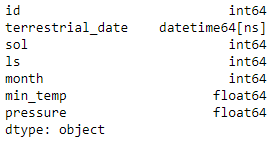
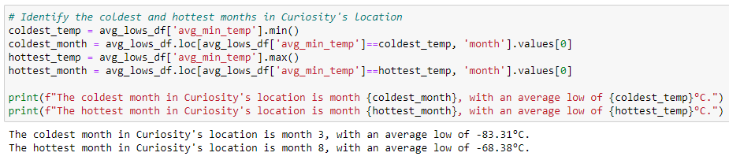

# Mission To Mars - Module 11 Challenge
UNC Chapel Hill Data Analytics Bootcamp

## Overview of Project
For Module 11, Splinter and Beautiful Soup were used in conjuction with Python, Pandas, and NumPy in Jupyter Notebook to scrape web data from NASA and Amazon Web Services. Click the arrows to show images associated with each text blurb.

## Method & Results
### Part 1 - Scraping article titles and blurbs from the [NASA Mars news nite](https://redplanetscience.com/)

Using Splinter, the automated browser was commanded to connect to redplanetscience.com). The home page contains an overview of the most recent articles, with images, titles, and previews.

Beautiful Soup took the HTML of the page, storing all of it in an object. Looking at the raw HTML, we can see which containers hold the desired data.

Beautiful Soup's find_all function was used to find all areas of HTML contained within a &lt;div class="col-md-8" /&gt; tag. All articles on the website are held within these tags, and each article contains a list date, title, and blurb.

Using Python and Beautiful Soup's find and text functions, the articles' titles and previews were extracted from the HTML and added to a list of dictionaries, with each dictionary containing one article title and blurb. The scraped data was then exported to JSON format (articles.json) and a MongoDB database.

### Part 2 - Scraping and analyzing weather data from the [Mars temperature data site](https://data-class-mars-challenge.s3.amazonaws.com/Mars/index.html)

As in part 1, Splinter was directed to connect to the Amazon Web Services Mars temperature data site. The page contains a large table with data on Mars sent from the Mars Rover.

Using Beautiful Soup, the HTML of the Mars temperature data site was scraped and sent to an object.

The Beautiful Soup's find_all function extracted all HTML contained in &lt;tr class="data-row" /&gt; tags. Each individual row in the table is held in one of these tags and contains seven values - the ID number, date on Earth, number of elapsed Martian days since Curiosity landed, solar longitude, Martian month, minimum temperature (°C) of the Martian day, and atmospheric pressure.

The Beautiful Soup find_all and text functions were then used to extract the data from the HTML and send it to a list of dictionaries, with each dictionary containing the values from one row.

This was then translated into a Pandas dataframe. To prepare for data analysis, the data types were also updated (e.g., setting the ID column to integers).

 

## Analysis
Five questions were answered using the created dataframe:
1. How many months exist on Mars?
  

  
A Martian year consists of 12 months.

  

  

2. How many Martian days' worth of data exist in the scraped dataset?
  

  
The dataset contains 1,867 unique Martian days.

  

  

3. What are the coldest and warmest months on Mars (at the location of Curiosity)?
  

  
Based on the averages created by the dataset, the third month is the coldest and the eighth month is the warmest.

   

  

4. Which months have the lowest and highest atmospheric pressure on Mars?
  

  
Based on the averages created by the dataset, the sixth month has the lowest pressure and the ninth month has the highest.

   

  

5. About how many terrestrial days exist in a Martian year?
  

  
A Martian year is roughly 687 terrestrial days.

   

  

